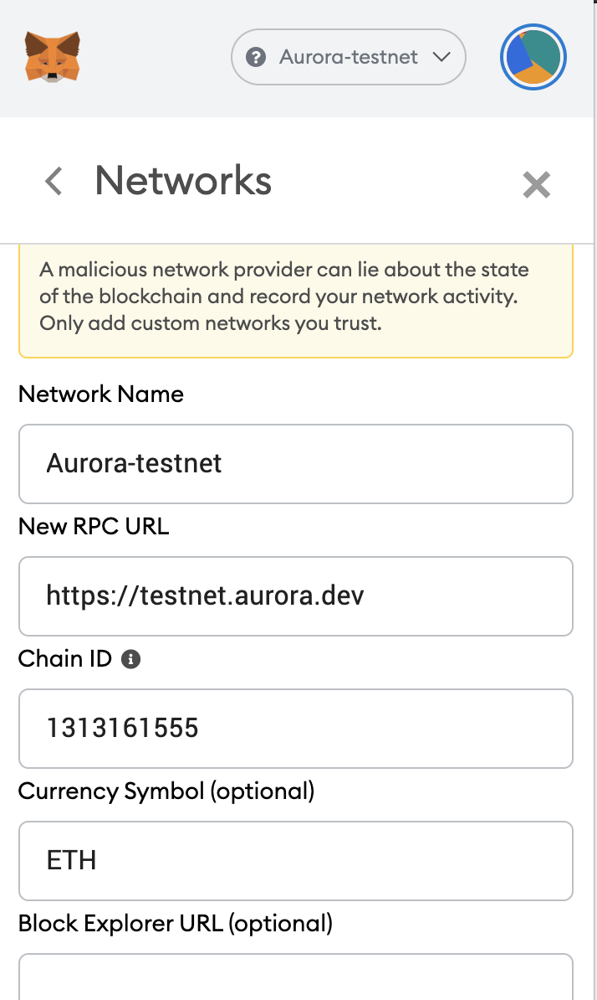
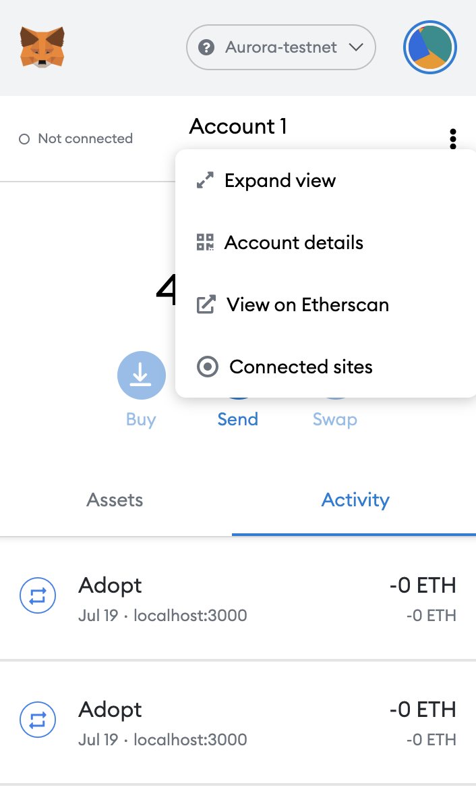
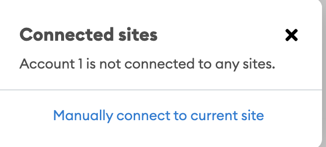
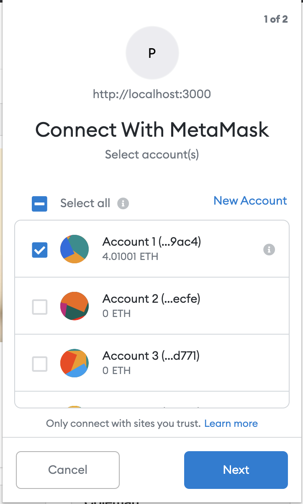
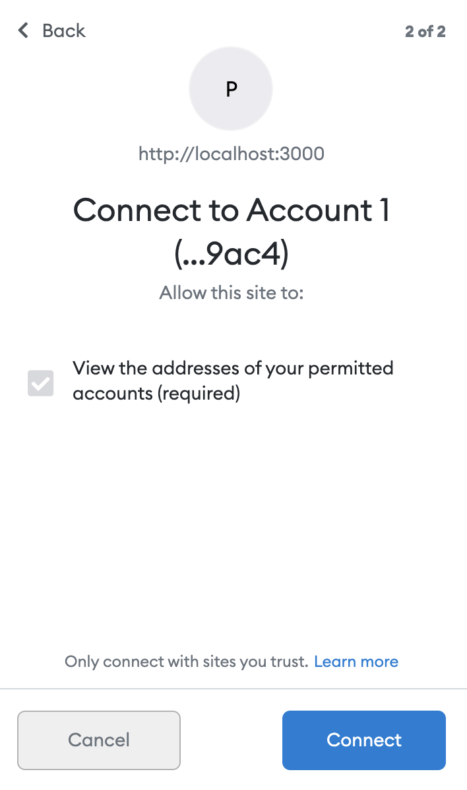
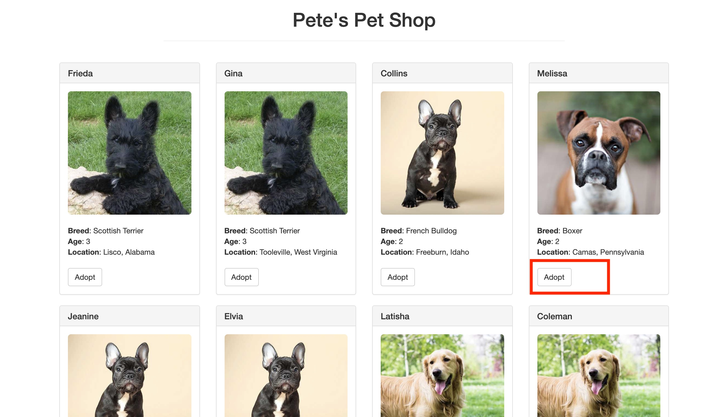
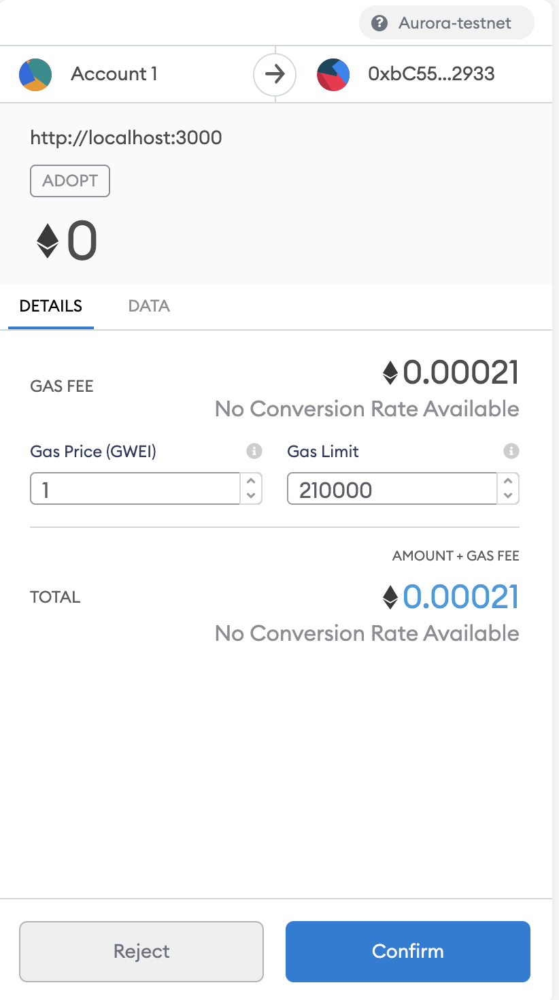
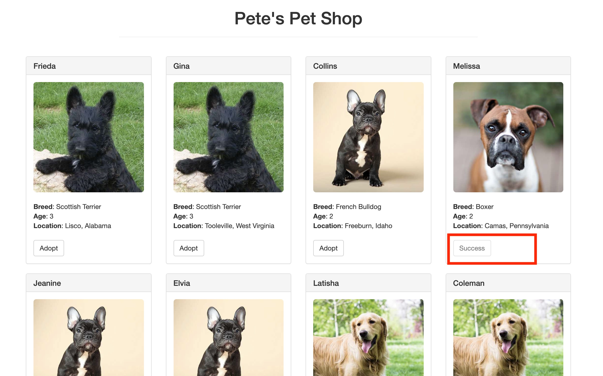

# Pet Shop DApp

Code for the workshop on deploying PetShop DApp on Aurora network

The objective of this workshop is to show how to deploy a sample DApp on Aurora testnet. The complete Truffle Pet-shop DApp is orginally forked from [here](https://github.com/trufflesuite/pet-shop-tutorial).

Live demo running at *[TBD]()*.

## Structure

- `contracts`: Pet shop adoption contract.
- `scripts`: contains the deployment script.
- `src`: DApp server and client side

## Scripts

- `yarn deploy:aurora`: Compiles and deploy Adoption.sol contract on Aurora testnet.
- `yarn dev`: Starts the DApp server

## Prerequisites

- Install dependencies
```bash
yarn 
```

## Environment

Expected `.env` file in the project root:

- `INFURA_TOKEN`: The infura api key for Ropsten testnet
- `NMEMORIC`: Ethereum NMEMORIC 

Use this [iancoleman.io/bip39/](https://iancoleman.io/bip39/) to generate `NMEMORIC` on the fly.

## Run

To run the workshop code, you should go through the following steps:

### Fork and clone the repo

First fork the repository and then Git Clone your fork to your computer and install dependencies

```bash
$ git clone https://github.com/aurora-is-near/pet-shop-tutorial.git
$ cd pet-shop-tutorial
$ yarn
```

### Configure the project

Create a `.env` file in the project root

```bash
INFURA_TOKEN='YOUR INFURA API KEY'
NMEMORIC='YOUR NMEMORIC HERE'
```

```bash
set -a # exports all the env vars
```

### Deploy Adoption contract on Ropsten testnet

The following command will deploy an Adoption contract on Aurora.
```bash
yarn deploy:aurora
```

The Adoption contract address is `0xbC5502C0606a815aaE39c93618010B7560752933`


### Start DApp Server
In a new ternminal, run the `liteserver` development server. It serves the front-end on http://localhost:3000

```bash
yarn dev
```

#### Connect Metamask to Aurora testnet

Use the following connection details to add Aurora as a custom network.



Please make sure that you are using `ETH` as a `Currency Symbol`.

### Connect DApp to Metamask 

If the Dapp didn't connect automatically to your Metamask, please connect it manually as follows:

- In your metamask, from your account, click on `connected sites`



- Connect manually to the current site:



Then choose which account you need to connect:



- Finally click `connect`



Now You should be able to notice your Metmask is `connected` to `the localhost:3000`.


### Adopt new pet

By clicking on `Adopt` button for any pet available for adopting:





The DApp will redirect the request to `Adoption` contract on Aurora testnet using Metamask. 



Make sure to set the value of `Gas Price` to at least `1` and the gas limit to at least `210000`.

Click `Confirm`

After a couple of seconds, the pet status will be changed to `success` as shown below:



### Get The Adopters List

You can also interact directly with the smart contract using Truffle console:

```bash
% truffle console --network aurora                                                          
truffle(aurora)> let adoption = await Adoption.deployed()
truffle(aurora)> let adopters = await adoption.getAdopters()
truffle(aurora)> adopters
[
  '0x0000000000000000000000000000000000000000',
  '0x0000000000000000000000000000000000000000',
  '0x0000000000000000000000000000000000000000',
  '0x6A33382de9f73B846878a57500d055B981229ac4', # The adopter address
  '0x0000000000000000000000000000000000000000',
  '0x0000000000000000000000000000000000000000',
  '0x0000000000000000000000000000000000000000',
  '0x0000000000000000000000000000000000000000',
  '0x0000000000000000000000000000000000000000',
  '0x0000000000000000000000000000000000000000',
  '0x0000000000000000000000000000000000000000',
  '0x0000000000000000000000000000000000000000',
  '0x0000000000000000000000000000000000000000',
  '0x0000000000000000000000000000000000000000',
  '0x0000000000000000000000000000000000000000',
  '0x0000000000000000000000000000000000000000'
]
truffle(aurora)> 
```

